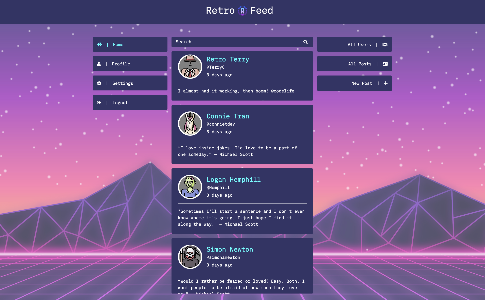
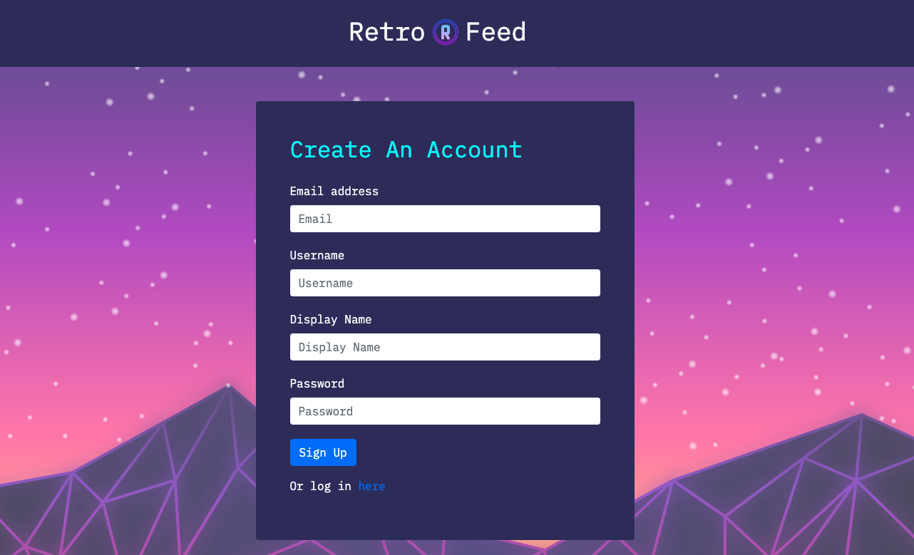
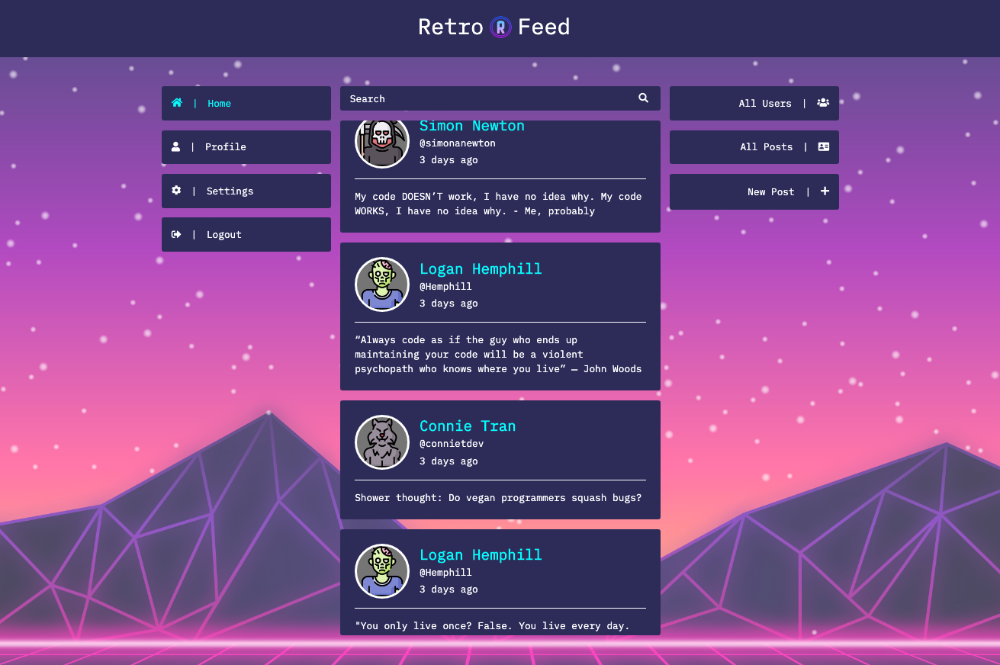
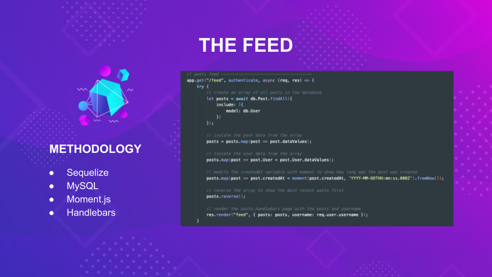
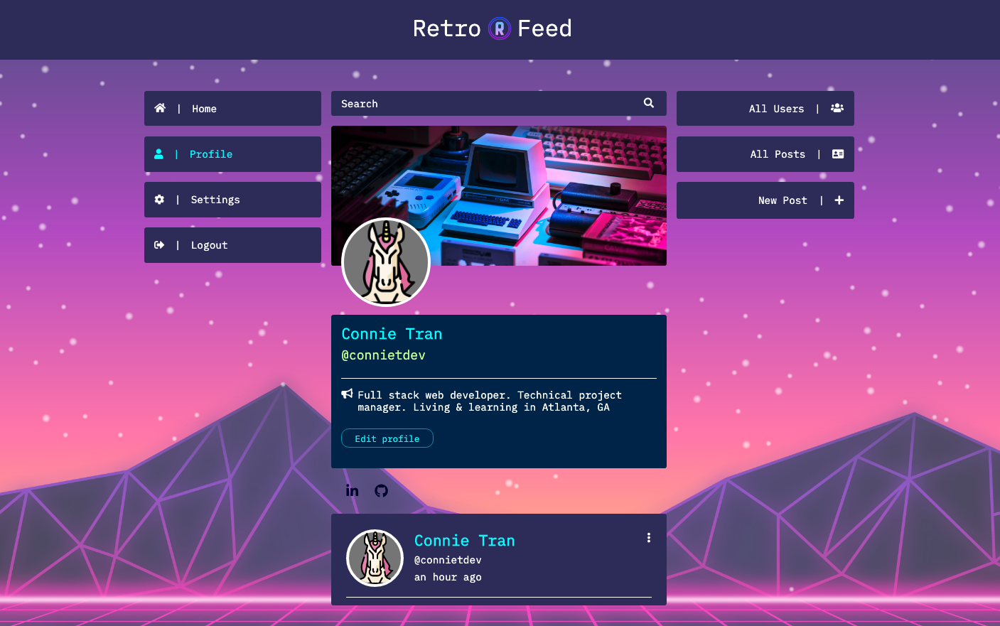
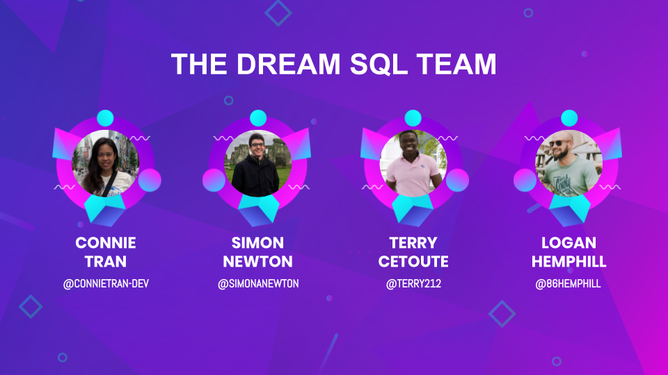

# RetroFeed: Retro Social Media

    

## Description

RetroFeed is a social media platform reimagined if social media existed in the 80s. RetroFeed gives a retro feel to a technology that has become a part of our modern, everyday lives. The idea was originally inspired by an episode of the show, The Office, in which Jim Halpert dresses as "BookFace". The team was also inspired by old-school interfaces and operating systems like MS-DOS.

Users can sign up for an account and post their own "ping" as we call it. Their feed updates in real-time to reflect their latest post as well as a feed of all of the latest pings. Their profile can be customized with their own avatar image, banner, bio, and social media links. Our priority was developing a fun, customizable, data-driven experience that was easy to use. 

    

## Check it out

The web application is deployed to production and hosted on Heroku. The live site can be found here: http://retro-feed.herokuapp.com

You can create your own account or be our guest by using the following guest log-in:

    Email:      ourguest@test.com  
    Password:   retro8080

After logging in, feel free to create your own post or customize your profile with your own avatar and banner image.

To find out more about the inspiration behind this project and a walkthrough of our codebase, check out our pitch deck here: [RetroFeed Pitch Deck](https://docs.google.com/presentation/d/1j-7aFy9aerfLOTIoCq851gWlsV2RFS7MMjMjF9Gyqcw/edit?usp=sharing)  

    

# Table of Contents
* [Technology](#technology)
* [Methodology](#methodology)
* [Installation](#installation)
* [The Team](#team)
* [Future Enhancements](#future-enhancements)
* [The Team](#the-team)
* [Credits](#credits)
* [License](#license)

# Technology

RetroFeed is a web application built using the following technologies:

* [Handlebars.js](https://handlebarsjs.com/) - Templating engine to dynamically generate the data-driven frontend, such as the feed and user profile
* [Passport.js](http://www.passportjs.org/) - Used for log-in authentication
* [express-session](https://www.npmjs.com/package/express-session) - Used for storing user session information for authentication
* [Sequelize](https://sequelize.org/) (MySQL) - ORM for interfacing with the MySQL database backend
* [Express](https://expressjs.com/) - Middleware for routing HTTP requests
* [NodeJS](https://nodejs.org/en/) - Javascript runtime environment for the application
* [Heroku](https://www.heroku.com/) - Application and database hosting

The application utilizes an MVC paradigm which is a reflection of the organization of the codebase as follows:

* [`config/`](https://github.com/simonanewton/project-2/tree/master/config) - Configuration files for the MySQL database and for Passport.js. We use [`dotenv`](https://www.npmjs.com/package/dotenv) to manage environment variables
* [`db/`](https://github.com/simonanewton/project-2/tree/master/db) - Seed file which creates MySQL database schema
* [`models/`](https://github.com/simonanewton/project-2/tree/master/models) - `Sequelize` models for new users and social media posts
* [`public/`](https://github.com/simonanewton/project-2/tree/master/public) - Javascript and CSS files used for production site
* [`routes/`](https://github.com/simonanewton/project-2/tree/master/routes) - Express HTML routes for handling HTTP requests and protecting requests by checking authentication; Also contains routes for API requests for things like creating a new user and POST-ing a new post (pun intended)
* [`views/`](https://github.com/simonanewton/project-2/tree/master/views) - Handlebar templates and partials used to generate HTML
* [`server.js`](https://github.com/simonanewton/project-2/blob/master/server.js) - Main file for setting up the application server

# Methodology

## Sign-Up & Login

The Sequelize models defined in [`models/`](https://github.com/simonanewton/project-2/tree/master/models) create the `Users` and `Posts` tables in the MySQL database server for the application. 

Upon creating an account, the application creates an instance of a user from the Users model defined using Sequelize in the [`new-user.js`](https://github.com/simonanewton/project-2/blob/master/models/new-user.js) file and creates a new row in the `Users` table. As part of storing the new user instance, their password is hashed using the npm package, [`bcrypt`](https://www.npmjs.com/package/bcryptjs).

You will then be automatically logged in and redirected to the `/feed` using `Passport.js`. If you log in directly from the Login page, `Passport.js` is also used for authentication. Session information is managed by `express-session` and is used to protect HTML routes. If you are not authenticated, you cannot access internal pages of the site such as the feed or your profile.

    

## Posts and Users Feed

The home feed of user-generated posts and list of All Users in the sidebar are dynamically generated using Handlebars templates and Sequelize queries, such as `db.Post.findAll`, in [`html-routes.js`](https://github.com/simonanewton/project-2/blob/master/routes/html-routes.js).

    

The data is isolated out of the MySQL database and transformed into data utilized the Handlebars templates.

    

### User Profile & Settings

    

## Installation

To run this program locally, `git clone` the repo, and run `npm install` in order to install the npm packages required to run this application as indicated in the [`package.json`](https://github.com/simonanewton/project-2/blob/master/package.json).

Then, to create a local instance of the required database on your machine, run the script `npm run seed` which will run a local MySQL database.

## Usage

You can run the application server by running `npm start` or use Nodemon for development by running `npm run watch`.

## Retrospective

    

## Future Enhancements

The team had a great time developing the MVP product. We'd love to continue building and enhancing the site with some of our top wishlist items:

* User follow functionality: The schema in the database for user following has been implemented - The following remains:
    * Displaying follower/following relationships
    * Constraints on the All Users page to hide your own profile
* Sharing of posts
* Like/reaction functionality
* Displaying of profile on hover of profiles in feed

Our Trello board has the work accomplished so far as well as our Backlog: https://trello.com/b/AEhzw796/project-2

Feel free to submit any features you'd like to see via our GitHub repo: https://github.com/simonanewton/project-2/issues

## The Team

* Connie Tran, [@connietran-dev](https://github.com/connietran-dev)
* Simon Newton, [@simonanewton](https://github.com/simonanewton)
* Terry Cetoute, [@terry212](https://github.com/terry212)
* Logan Hemphill, [@86hemphill](https://github.com/86hemphill)

    

## Credits

* https://www.npmjs.com/package/express
* https://www.npmjs.com/package/express-handlebars
* https://www.npmjs.com/package/mysql2
* https://www.npmjs.com/package/sequelize
* https://www.npmjs.com/package/dotenv
* https://www.freepik.com - Background image
* https://www.flaticon.com - Avatar images
* https://unsplash.com - Banner images
* https://slidesgo.com/ - Pitch deck

## License

MIT License

Copyright (c) [2020] [Simon Newton, Connie Tran, Logan Hemphill, Terry Cetoute]

Permission is hereby granted, free of charge, to any person obtaining a copy
of this software and associated documentation files (the "Software"), to deal
in the Software without restriction, including without limitation the rights
to use, copy, modify, merge, publish, distribute, sublicense, and/or sell
copies of the Software, and to permit persons to whom the Software is
furnished to do so, subject to the following conditions:

The above copyright notice and this permission notice shall be included in all
copies or substantial portions of the Software.

THE SOFTWARE IS PROVIDED "AS IS", WITHOUT WARRANTY OF ANY KIND, EXPRESS OR
IMPLIED, INCLUDING BUT NOT LIMITED TO THE WARRANTIES OF MERCHANTABILITY,
FITNESS FOR A PARTICULAR PURPOSE AND NONINFRINGEMENT. IN NO EVENT SHALL THE
AUTHORS OR COPYRIGHT HOLDERS BE LIABLE FOR ANY CLAIM, DAMAGES OR OTHER
LIABILITY, WHETHER IN AN ACTION OF CONTRACT, TORT OR OTHERWISE, ARISING FROM,
OUT OF OR IN CONNECTION WITH THE SOFTWARE OR THE USE OR OTHER DEALINGS IN THE
SOFTWARE.
